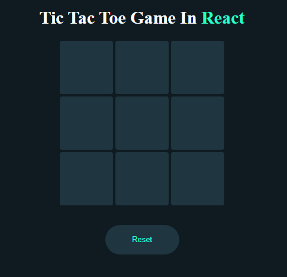
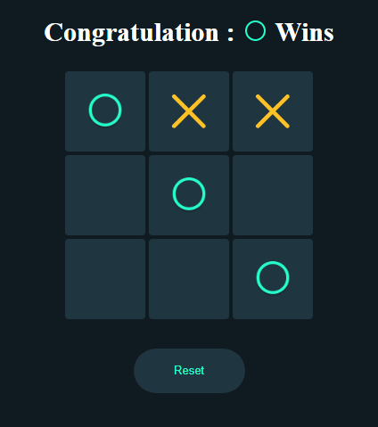
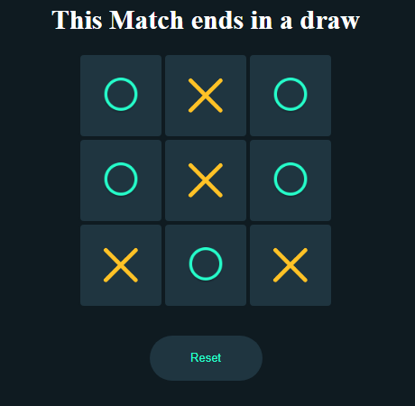

# React Tic-Tac-Toe Game

This is a simple Tic-Tac-Toe game built using React.js.

## How to Play

1. Start the game by clicking on any square to place your X or O.
2. The game will alternate between X and O until there is a winner or a draw.
3. The first player to get three of their marks in a row (horizontally, vertically, or diagonally) wins the game.
4. If all squares are filled and there is no winner, the game ends in a draw.

## Features

- Interactive game play with a visual representation of player moves.
- Automatic detection of winning combinations.
- Restart button to start a new game.

- ## Screenshots

Here are some screenshots of the application:

## Installation

1. Clone this repository to your local machine.
2. Navigate to the project directory.
3. Run `npm install` to install dependencies.
4. Run `npm run dev` to start the development server.
5. Open your browser and navigate to Local host.

## Contributing

Contributions are welcome! If you find any bugs or have suggestions for improvement, please open an issue or submit a pull request. 

## Author

This project was created by [kalaivathanan](https://github.com/kalaivathanan).

## License

This project is licensed under the MIT License. See the [LICENSE](LICENSE) file for details.
